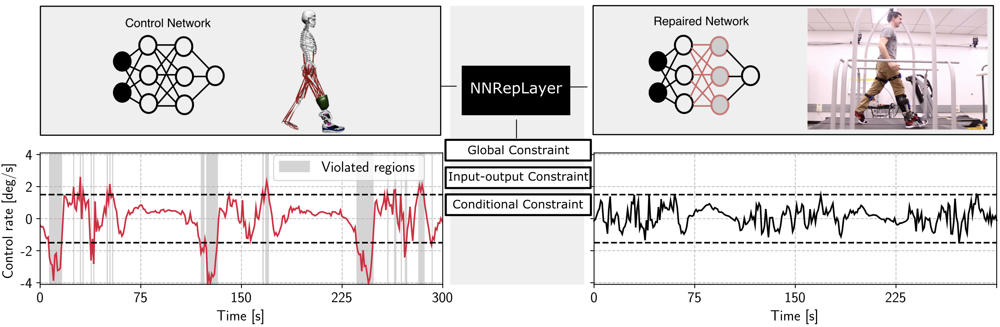

# Safe Robot Learning in Assistive Devices through Neural Network Repair 


## Introduction
Assistive robotic devices are a particularly promising field of application for neural networks (NN) due to the need for personalization and hard-to-model human-machine interaction dynamics. However, NN based estimators and controllers may produce potentially unsafe outputs over previously unseen data points. In this paper, we introduce an algorithm for updating NN control policies to satisfy a given set of formal safety constraints, while also optimizing the original loss function. Given a set of mixed-integer linear constraints, we define the NN repair problem as a Mixed Integer Quadratic Program (MIQP). In extensive experiments, we demonstrate the efficacy of our repair method in generating safe policies for a lower-leg prosthesis. This repository contains the code. Please refer to our [publication at CORL 2022](https://openreview.net/pdf?id=X4228W0QpvN) for more details.

If you find our work useful, please consider citing our paper:
```
@inproceedings{majd2022safe,
    title        = {Safe Robot Learning in Assistive Devices through Neural Network Repair},
    author       = {Majd, Keyvan and Clark, Geoffrey Mitchell and Khandait, Tanmay and Zhou, Siyu and Sankaranarayanan, Sriram and Fainekos, Georgios and Amor, Heni},
    booktitle    = {6th Annual Conference on Robot Learning},
    year         = {2022}
    organization = {PMLR}
}
```


## Setup
We use the Poetry tool which is a dependency management and packaging tool in Python. It allows you to declare the libraries your project depends on and it will manage (install/update) them for you. Please follow the installation of poetry [here](https://python-poetry.org/docs/#installation). After you've installed poetry, you can install NNrepLayer by running the following command in the root of the project:

    poetry install

Since we also make of the gurobi optimizer, we need to set it up for python. This can be easily done by installing gurobi, the instructions of which can be found here. In order to set it up for python, run the setup.sh file and pass the python identifier and the complete path to folder that contains the setup.py file in the gurobi folder using the following commands:

    sudo ./setup.sh <Python-Identifier> <Path-To-Folder>

For Example, if Python-Identifier was python3.8 and the path to gurobi folder that contains the *setup.py* file is */home/local/user/gurobi950/linux64/build/*, issue the following command:

    sudo ./setup.sh python3.8 /home/local/user/gurobi950/linux64/build/

## Quick Start
You can find the examples of NNRepLayer for the Prosthesis application under `/examples` ([here](/examples)). 
Our tool currently supports the models trained with [tensorflow 2 (tf2)](https://www.tensorflow.org) and [PyTorch 1](https://pytorch.org). 
The code examples for loading models saved by common frameworks will be released soon. 

### Training 
For training models with default parameters run the `00_net_train.py` script in each example. 
We used *Keras (tf2)* to train the models. The trained model will be located in `model_orig` in the example's directory.
The training walking data is also provided under `/data` in example's directory.

### Repairing
For repairing models, please follow the repair notebook tutorials `01_net_repair.ipynb` under each example's directory. The repaired models will be saved under `<example directory>/repair_net/models`. You can also find the optimization log files and formulations under `<example directory>/repair_net/logs` and `<example directory>/repair_net/summary`, respectively.

As we used [Pyomo](http://www.pyomo.org) for formulating the MIQP optimization, other solvers listed [here](https://pyomo.readthedocs.io/en/stable/solving_pyomo_models.html#supported-solvers) are also supported by our tool. Our choice of optimizer is [Gurobi](http://www.gurobi.com), but any supported optimizer by Pyomo will work. We also suggest you to use `Gurobi` as its performance is significantly faster (it also has free academic license!).
Note that the selected solver should be specified for the NNRepLayer (read [examples](/examples)).

## Results
| Method         | Running Time [s] | MAE Error | Repair Efficacy[%] | Introduced Bug [%] |
| -------        | ---------------  |--------------- |--------------- |--------------- | 
| NNRepLayer     | $112\pm122$| $0.5\pm0.03$   | $98\pm1$ | $0.19\pm0.18$ | 
| REASSURE ([here](https://arxiv.org/pdf/2110.07682.pdf))|$30\pm8$| $0.6\pm0.03$   | $19\pm4$ | $85\pm5$ | 
| Fine-tuning|$8\pm2$| $0.6\pm0.03$   | $88\pm2$ | $2.48\pm0.49$ | 
| Retraining|$101\pm1$| $0.5\pm0.04$   | $98\pm2$ | $0.28\pm0.32$ | 
